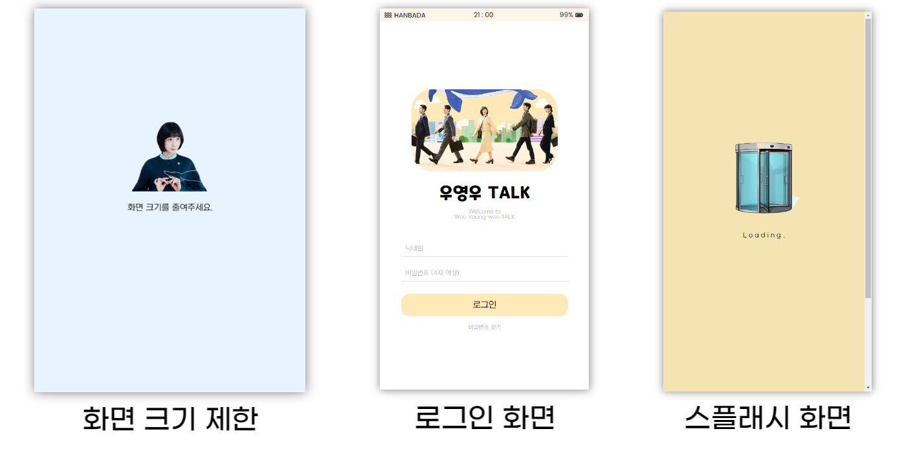
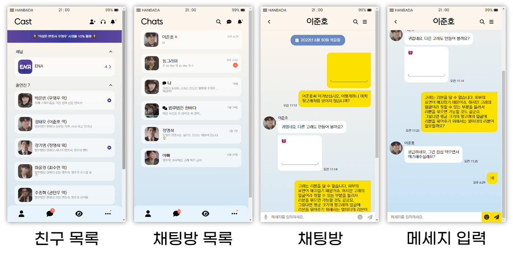
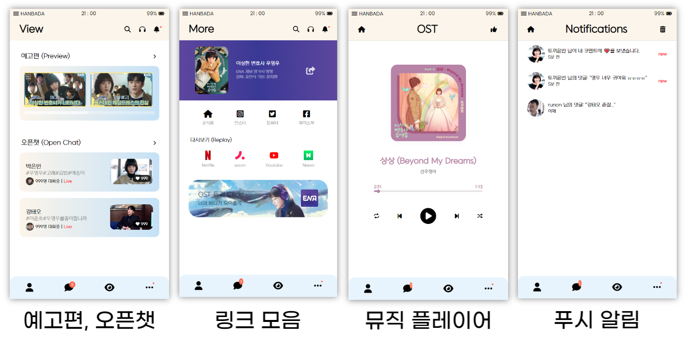

 

# 우영우 TALK

🚀 [프로젝트 링크](https://rigood.github.io/kokoa_challenge/)

HTML, CSS 를 사용하여, 드라마 '이상한 변호사 우영우' 를 주제로 카카오톡 UI 구현

 

🏆 [우수졸업생 선정](https://nomadcoders.co/community/thread/5676)

Nomad Coders 코코아 챌린지 31기 (2022. 7. 4. ~ 7. 18.)

 

## Pages

 
 

 
 

 

## Features

- Flexbox
- Media Query
- Splash Screen
- Transitions, Animations

 

## 개선할 점

- 반응형 작업 (글자 크기, 여백)
- 뮤직 플레이어에 mp3 연결 및 버튼 기능 구현
- WebSocket으로 실시간 채팅 기능 구현

 

## 느낀 점

- 컴포넌트화의 필요성
  - HTML로만 구현하는 경우, 모든 요소를 일일이 마크업 해야한다.
  - 중복되는 코드가 많고, 유지보수가 비효율적이다.
     
     
- 반응형 웹의 필요성
  - 현재 px 단위의 스타일은 화면 크기가 작아지면 레이아웃이 깨지는 문제점이 있다.
  - 디바이스 화면 크기에 따라 유동적인 레이아웃을 제공하도록 개선할 계획이다.
     
     
- BEM 방법론의 장단점
  - 장점: 클래스명만으로 목적, 기능, 구조를 쉽게 파악할 수 있다.
  - 단점: 클래스명이 길고 복잡해진다.
     
     
- 'ad' 로 시작하는 클래스명 사용 금지
  - 크롬 확장프로그램 'AdBlocker'에 의해 차단된다.
